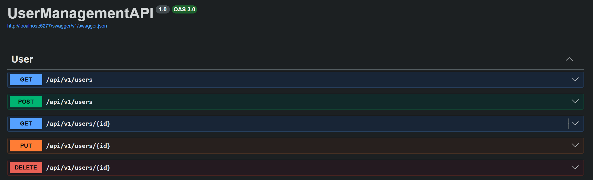
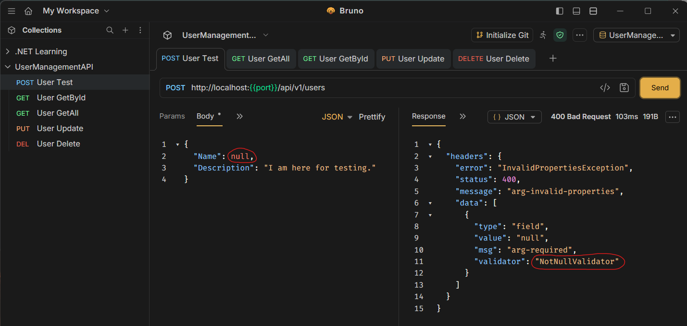
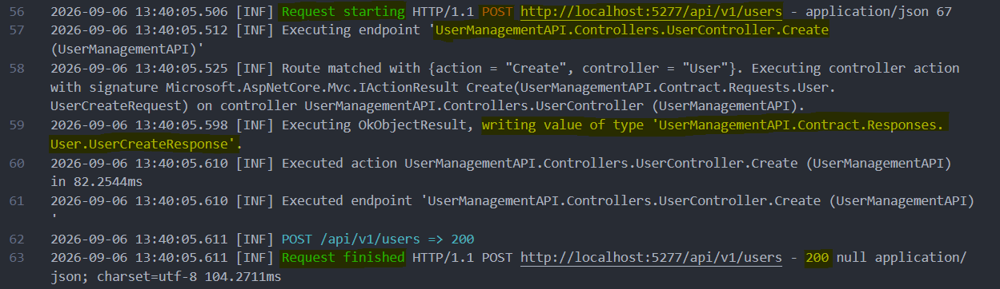

# yqni13 | $\texttt{\color{violet}{UserManagementAPI}}$
### $\textsf{\color{brown}{v1.0.0}}$

### Coursera certificate [Microsoft Full-Stack Developer, Course 5: Back-End Development with .NET] ASP.NET Core project (user management api in .NET v10).

<br>

## 🪄 $\textsf{\color{salmon}Getting started}$


### $\textsf{\color{teal}Prerequisites}$
- .NET: v10.0.400

<br>

### $\textsf{\color{teal}Local setup}$
Download or clone project
```sh
git clone https://github.com/yqni13/UserManagementAPI.git
```

Manually add Properties/launchSettings.json to configurate port and environment secrets.
See configs for local development/testing and add values for <port> and <token>:
```sh
{
    "$schema": "https://json.schemastore.org/launchsettings.json",
    "profiles": {
        "http": {
            "commandName": "Project",
            "dotnetRunMessages": true,
            "launchBrowser": true,
            "launchUrl": "swagger",
            "applicationUrl": "http://localhost:<port>",
            "environmentVariables": {
                "ASPNETCORE_ENVIRONMENT": "Development",
                "AUTH_TOKEN": <token>
            }
        }
    }
}
```

<br>

Restore ...
```sh
dotnet restore
```
... and build (bin/ and obj/ are created) ...
```sh
dotnet build
```

... before you run the application and wait for SwaggerUI to open in your browser.
```sh
dotnet run
```

<br>

## 🧩 $\textsf{\color{salmon}Features (Grading Criteria)}$

| Feature | Description |
|---------|-------------|
| 🛠️ CRUD | Basic operations (Get all/single, Create, Update, Delete user) see [(UserController)](./UserManagementAPI/Controllers/UserController.cs)
| 🤖 AI | Debugging and development assisting by Copilot => search [Copilot] marker |
| 🔎 Validation | Using FluentValidation to check query params and body payloads, see [(Validator example)](./UserManagementAPI/Validations/User/UserCreateValidator.cs)
| 🗒️ Logging | Write workflow into log file (method, path, status code), see [(LoggingMiddleware)](./UserManagementAPI/Middleware/LoggingMiddleware.cs)
| 🗝️ Auth | Simple auth via Bearer-Token comparison from env secrets, see [(AuthenticationMiddleware)](./UserManagementAPI/Middleware/AuthenticationMiddleware.cs)

<br>

## 🗺️ $\textsf{\color{salmon}Swagger}$

To test the API open Swagger (only by `dotnet watch run`) or see the DTO's for query params and body payloads [(Contract)](./UserManagementAPI/Contract/Requests/), if you prefer using with development tools like Postman, Insomnia, Bruno, ...<br>
For authentication each request requires a `Bearer Token` that fits the set up env secret [AUTH_TOKEN].
<div align="center">
    
    Figure 1 - Swagger CRUD operations API, v1.0.0
</div>

<br>

## 🔧 $\textsf{\color{salmon}Testing}$

Query params and body payloads are validated and throw exceptions with common and specific information. Validations throw either `InvalidPropertiesException` or `EmptyPayloadException` for invalid cases on status code 400 and the common message "arg-invalid-properties" as well as the specific data. The common `message` and the data specific `msg` use my (as developer) selected format compatible to translations used in my projects. The validator value `NotNullValidator` reflects the FluentValidation rule in use. For more information, see [(Validators)](./UserManagementAPI/Validations/User/).
<div align="center">
    
    Figure 2 - Test API by Bruno, Request User Create, v1.0.0
</div>

<br>

Payloads can be tested on different scenarios:
| Scenario | Location | Mechanism |
|----------|----------|-----------|
| Missing payload | ValidationMiddleware | Custom check |
| Empty payload | ValidationMiddleware | Custom check |
| Wrong property types | ValidationFilter | ModelBinding |
| Wrong property values | ValidationFilter | RuleSets |

<br>

## 📝 $\textsf{\color{salmon}Logging}$

The green marker shows the screenshot of a logging sequence of a processed request (`Request starting` to `Request finished`). The orange marker shows the `Http-Method POST` in use, using the yellow marked route. The next yellow marking points to the used function `Create() within the UserController` class. After processing the request, the following yellow marked information stands for the used `Response DTO 'UserCreateResponse'` that is deserialized (OkObjectResult).<br>
The blue marking shows the summary of the demanded information (`method, path, status code`).

<div align="center">
    
    Figure 3 - Logging Sample, Request User Create, v1.0.0
</div>